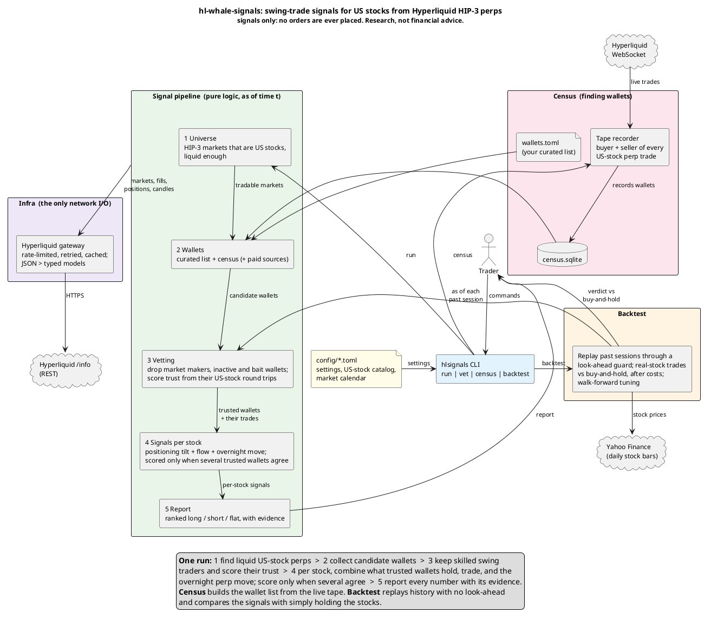

# hl-whale-signals

Swing-trade **signals** for US-listed stocks, derived from what "smart money" does on
Hyperliquid's HIP-3 equity perpetuals (e.g. `xyz:NVDA`): how trusted wallets are
positioned, what they have been buying or selling, and how the perp moved since the last
US cash close.

**Signals only.** Nothing here places orders. You read the report and trade manually.
**Research, not financial advice.**

---

## How it works



(Source: `docs/architecture.puml`, PlantUML.)

```
discover markets ─► filter markets ─► fetch wallets ─► vet wallets ─► positions ─► signals ─► rank ─► report
 (HIP-3 dexes,       (liquidity)       (curated list,   (filters +     (accepted   (tilt, flow,
  US stocks only)                       census, paid)    trust score)   wallets)    overnight)
```

1. **Universe.** Every live HIP-3 market is classified in `config/instruments.toml`
   (sourced from the trade.xyz specification). Only US-listed stocks (`equity_us`) produce
   signals. Crypto, foreign listings, ETFs, indices, commodities and FX are recognised and
   ignored. Markets below the volume / open-interest floors are dropped.
2. **Wallets** come from a hand-curated list, a **census** (a websocket recorder of every
   wallet trading US-stock perps), and optional paid sources.
3. **Vetting.** Each wallet's US-stock history (crypto never counts) is cut into
   **round trips** (flat → position → flat). Filters drop market makers / HFT, inactive
   wallets, wallets with too few trips, and wallets whose quick trades reliably precede
   reversals ("bait"). Survivors get a **trust** score.
4. **Signals** per stock, each in [-1, +1] (+ bullish): positioning **tilt** of trusted
   wallets, trusted **flow** relative to open interest, and the **overnight** perp move since
   the last cash close. A stock is scored only when enough independent trusted wallets are
   involved (**corroboration**): holding it now, or having traded it within
   `corroboration_window_hours` (default 24 h). The weighted mean gives a direction:
   long / short / flat.
5. **Backtest** replays past sessions without look-ahead and measures the signals on the
   real stocks against buy-and-hold, after costs, with walk-forward tuning.

---

## Setup

Requires Python 3.12.

```bash
python3 -m venv .venv
.venv/bin/pip install -e '.[dev]'
.venv/bin/hlsignals --help
```

Run commands from the repository root (config paths are relative to it).

Optional secrets (never put them in config files; the config loader rejects them):

```bash
export NANSEN_API_KEY=...     # enables the "nansen" wallet source (client not yet written)
export APIFY_API_TOKEN=...    # enables the "apify" wallet source (client not yet written)
```

---

## Commands

| command | what it does |
|---|---|
| `hlsignals census --minutes 60` | Records every wallet trading a US-stock perp (websocket) into `data/census.sqlite`. |
| `hlsignals run` | Builds the ranked signal report (`--format table\|markdown\|json`, `--output FILE`). |
| `hlsignals vet --wallet 0x… --wallets-file FILE` | Scores wallets and explains every filter decision. |
| `hlsignals backtest --start 2026-07-01 --end 2026-09-17 [--walk-forward]` | Replays past sessions against real stocks (`--format text\|json`). |
| `hlsignals discover` | Vets census wallets into the shortlist the daily run follows (`[discovery]`). |
| `hlsignals dashboard` | Read-only web view of the system state on port 8081 (`[dashboard]`). |
| `hlsignals capture-fixtures --out DIR` | Records a live run so `run --fixtures DIR` can replay it offline. |

Global options: `--config FILE` (TOML; defaults are built in), `-v` (progress on stderr).

**Typical first session**

```bash
hlsignals census --minutes 60                    # collect wallets (longer is better)
hlsignals -v run                                 # the report (slow first time: history)
hlsignals vet --wallets-file config/wallets.toml # check wallets you follow
```

A census mostly finds market makers (they trade constantly); swing traders appear rarely.
The fastest route to useful signals is **curating wallets you trust** in
`config/wallets.toml` (template inside), e.g. top copy-trading wallets from Hyperdash,
optionally with their copy score.

**Exit codes**: `0` ok, `2` configuration error (including bad arguments), `3` every wallet
source failed, `4` API error.

---

## Running unattended on a Raspberry Pi

Five systemd units in `system/` (same layout as the StockScanner project) run the whole
loop on their own, starting with **no wallets at all**:

| unit | when (New York time) | what |
|---|---|---|
| `hlsignals-census.service` | always on | records every wallet trading US-stock perps into `data/census.sqlite` |
| `hlsignals-dashboard.service` | always on | read-only web view at `http://<pi>:8081` |
| `hlsignals-discover.timer` | Sat 02:00 | vets census wallets (new first, rejected ones again after 28 days, accepted ones every week) into `data/discovered_wallets.toml` |
| `hlsignals-run.timer` | Mon–Fri 08:45 | the report, on `config/wallets.toml` + the shortlist → `data/reports/signals-YYYY-MM-DD.{txt,md,json}` and `signals-latest.*` |
| `hlsignals-backtest.timer` | Sun 02:00 | walk-forward backtest of the latest 80 sessions → `data/reports/backtest-*` |

Times are pinned to `America/New_York`, whatever the Pi's own timezone.

### 1. Prerequisites

- Raspberry Pi 4 or 5 (2 GB+ RAM; the weekly jobs are capped at 2 GB), wired or Wi-Fi
  network, on the same LAN as the computer you will browse from.
- `git` and **Python 3.12 or newer**. Check with `python3 --version`:
  - Raspberry Pi OS **Trixie** ships 3.13: nothing to do.
  - Raspberry Pi OS **Bookworm** ships 3.11: install 3.12 with
    [uv](https://docs.astral.sh/uv/) (no system change needed):
    ```bash
    curl -LsSf https://astral.sh/uv/install.sh | sh     # then open a new shell
    uv python install 3.12
    ```

### 2. Install (as the normal user, e.g. `pi`)

```bash
mkdir -p ~/dev && cd ~/dev
git clone <this repository> hl-whale-signals
cd hl-whale-signals
bash system/setup-pi.sh
# Bookworm with uv instead:  PYTHON="$(uv python find 3.12)" bash system/setup-pi.sh
```

`setup-pi.sh` checks the Python version, creates `.venv`, installs the package and
creates `data/reports/`. It ends with `OK`.

Optional now or later: add wallets you already trust to `config/wallets.toml` (template
inside). With none, the system relies entirely on what it discovers.

### 3. Install and start the services

```bash
sudo bash system/install-services.sh      # copies the units (fills in your user and this directory)

sudo systemctl enable --now hlsignals-census.service
sudo systemctl enable --now hlsignals-dashboard.service
sudo systemctl enable --now hlsignals-discover.timer
sudo systemctl enable --now hlsignals-run.timer
sudo systemctl enable --now hlsignals-backtest.timer
```

Check that everything started:

```bash
systemctl status hlsignals-census.service hlsignals-dashboard.service --no-pager
systemctl list-timers --all | grep hlsignals      # shows the next run of each job
journalctl -u hlsignals-census.service -n 20 --no-pager
```

Both services should be `active (running)`, and the three timers should list a next run.

### 4. Open the dashboard

Find the Pi's address on the Pi with `hostname -I` (e.g. `192.168.1.50`), or use its
name (`http://raspberrypi.local:8081` on most home networks). From any browser on the
same network, open:

```
http://192.168.1.50:8081
```

LAN-only, no password, **read-only**: it only shows what the jobs produced.

- **Overview**: start here. Every service/timer should be green (a failed job shows
  red), the census card should say `recording`, and the wallet funnel shows census →
  eligible (≥ 20 trades) → shortlist → accepted. It also shows the latest signals, the last
  discovery and the last backtest verdict. Refreshes every 5 minutes.
- **Signals**: the latest (or any dated) report: ranked long/short stocks with every
  component's evidence, the wallets behind them, and the diagnostics.
- **Wallets**: the discovered shortlist with trust, your curated list, and recent
  vetting decisions with the filter that rejected each wallet (addresses link to the
  Hyperliquid explorer).
- **Census**: recording or stale, wallets and trades seen, new wallets per day, the most
  active wallets.
- **Backtest**: the verdict (BEAT / DID NOT BEAT buy-and-hold / INCONCLUSIVE),
  strategy vs buy-and-hold, walk-forward folds, caveats; past runs.

### 5. The first weeks (starting with no wallets)

| when | what you should see |
|---|---|
| day 0 | Census `recording`; wallet counts climbing on the Census page. Reports say every stock is `insufficient`, as expected. |
| after a few days | Wallets with ≥ 20 trades appear in the funnel. Run discovery now instead of waiting for Saturday: `sudo systemctl start hlsignals-discover.service` (can take an hour or more; follow it with `journalctl -u hlsignals-discover.service -f`). |
| after discovery | The Wallets page lists accepted wallets (if any passed). The next weekday 08:45 report uses them. |
| each Sunday | The Backtest page shows whether the shortlist's signals beat buy-and-hold. Treat anything before a non-INCONCLUSIVE verdict as unproven. |

Signals are research, not advice: read the evidence before acting, and trade manually.

### 6. Everyday commands

```bash
sudo systemctl start hlsignals-run.service        # make a report now (outside the schedule)
cat ~/dev/hl-whale-signals/data/reports/signals-latest.md
journalctl -u hlsignals-run.service -n 100 --no-pager
```

### 7. Updating

```bash
cd ~/dev/hl-whale-signals
git pull
.venv/bin/pip install -e .                        # picks up new dependencies
sudo bash system/install-services.sh              # if unit files changed
sudo systemctl restart hlsignals-census.service hlsignals-dashboard.service
sudo systemctl restart hlsignals-run.timer hlsignals-discover.timer hlsignals-backtest.timer
```

### 8. Troubleshooting

- **Dashboard does not load**: `systemctl status hlsignals-dashboard.service`; on the Pi,
  `curl http://127.0.0.1:8081/healthz` should print `{"ok":true}`. If that works but other
  machines cannot connect, a firewall is blocking the port (`sudo ufw allow 8081/tcp`
  if ufw is enabled). Port 8081 in use? Change `[dashboard] port` in `config/pi.toml`.
- **A service or timer is red**: `journalctl -u <unit> -n 100 --no-pager` shows why.
  Exit code 2 means a configuration error, 3 that every wallet source failed, 4 an API
  error (usually transient; the next run retries).
- **Census `stale`**: the recorder is not receiving trades:
  `sudo systemctl restart hlsignals-census.service`, then check its journal.
- **`market calendar covers …`**: extend `config/us_market_calendar.toml` with the new
  year's NYSE holidays (published on nyse.com).

### 9. Stopping or removing

```bash
sudo systemctl disable --now hlsignals-census.service hlsignals-dashboard.service \
    hlsignals-discover.timer hlsignals-run.timer hlsignals-backtest.timer
sudo rm /etc/systemd/system/hlsignals-*
sudo systemctl daemon-reload
```

Data (`data/`: census, discovery state, reports) stays in the project directory.

Configuration for the Pi is `config/pi.toml` (`[discovery]` sets how many wallets are
vetted per week and when rejected ones are revisited; `[dashboard]` the port).
`system/info` is a copy-paste cheat sheet of all these commands.

---

## Configuration

`config/example.toml` lists **every** key with its default and a comment. Any key can be
omitted. Unknown keys and wrong types are errors that name the field. All thresholds are
starting points to be tuned with the backtest, not claims of optimality.

| section | controls |
|---|---|
| `[universe]` | instrument catalog, included classes (`equity_us`), dex preference, volume / OI floors, optional watchlist |
| `[wallets]`, `[[wallets.sources]]` | sources (`curated`, `census`, `nansen`, `apify`) and their precedence |
| `[wallets.filters]` | filter order and thresholds (min round trips, maker profile, inactivity, bait) |
| `[wallets.scoring]` | feature weights, shrinkage, half-life, swing horizon |
| `[history]` | lookback of wallet history, candle interval, candle window for signals |
| `[signals]` | component weights, flow/overnight floors and full scales, corroboration, epsilon, flag thresholds |
| `[calendar]`, `[census]`, `[report]`, `[backtest]` | market calendar file, census database, default report format, backtest settings |
| `[discovery]` | census → shortlist: minimum census trades, wallets vetted per run, re-vet interval, output files |
| `[dashboard]` | bind address and port (default 8081), reports directory, when the census counts as stale |

The market calendar (`config/us_market_calendar.toml`) covers 2025–2028 from NYSE sources.
Dates outside it fail loudly; unscheduled closures must be added by hand.

---

## Reading the signal report

The same information appears in all three formats. JSON (`--format json`, schema version
1) is the stable machine-readable one.

### Top level

- `schema_version`: JSON schema version (currently 1).
- `as_of`: the moment the report describes (UTC).
- `disclaimer`: "not financial advice".
- `signals`: one entry per stock in the filtered universe, **ranked**: scored stocks by
  |score| (ties by ticker), then insufficient ones.
- `wallets`: the accepted wallets, by trust.
- `diagnostics`: what went in, what was dropped and why.

### Each signal

- `symbol`: the perp (`xyz:NVDA`); the stock is its coin (`NVDA`), with exceptions mapped in
  `[backtest].ticker_overrides` (e.g. `PURRDAT` → Nasdaq `PURR`).
- `status`: `scored`, or `insufficient` (not enough corroboration; no direction given).
- `direction`: `long`, `short` or `flat` (|score| ≤ epsilon); null when insufficient.
- `score`: weighted mean of the components, in [-1, +1]; null when insufficient.
- `n_wallets`: distinct **trusted** wallets (trust ≥ `min_trust`) holding or trading it.
- `reason`: how the direction was decided, or why it is insufficient, e.g.
  `0 trusted wallets < 3 (4 involved, trust >= 0.4)`: 4 accepted wallets were involved
  but none reached the trust threshold.
- `flags`:
  - `thin_volume`: 24h volume below `thin_volume_usd`.
  - `weak_sample`: the corroborating wallets' mean confidence is below `weak_confidence`.
  - `stale_overnight_ref`: the latest candle is older than `max_overnight_staleness_hours`
    (or no candles).
  - `cash_session_open`: the US market is open now, so the "overnight" move includes
    today's session.
- `components`: `value` in [-1, +1] and the `evidence` behind it:
  - **tilt** (positioning): `net_usd` (trust-weighted signed position value),
    `gross_usd` (trust-weighted absolute value), `tilt` = net / gross, `n_long`,
    `n_short`, `n_wallets` (wallets with a position), `mark_px`.
  - **flow**: `flow_usd` (trust-weighted signed notional traded in the window),
    `oi_usd` (open interest in USD), `flow_oi_frac` = flow / OI, `n_fills`, `n_wallets`,
    `window_hours`. The value is 0 below `min_flow_oi_frac` and ±1 at
    `flow_full_scale_oi_frac`.
  - **overnight**: `ref_px` (perp price at the last cash close), `last_px` (latest),
    `pct` (simple move), `log_return` (what the value is computed from), `stale`. The
    value is 0 below `min_overnight` and ±1 at `overnight_full_scale`.
  - `note` (any component): why a value is 0 (below the floor, no open interest, no
    candles, …).
- `market`: the market snapshot: `mark_px`, `oracle_px`, `prev_day_px`, `mid_px`,
  `open_interest` (contracts), `oi_usd` (= contracts × mark), `day_ntl_vlm` (24h volume
  in USD), `funding`, `is_delisted`.

### Each accepted wallet

- `address`: the wallet.
- `trust` = base × `confidence` × `decay`, in [0, 1]. The base is the weighted mean of the
  features below.
- `confidence` = trips / (trips + `shrinkage_k`): small samples count less.
- `decay` = 0.5 ^ (days since the last US-stock fill / `half_life_days`).
- `n_round_trips`: scored round trips (flat → position → flat; trips opened before the
  available history are never scored). `track_record_days`: first to last US-stock fill.
- `features` (each `value` in [0, 1] plus evidence and its `weight`):
  - **hit_rate**: Wilson lower bound of the win rate (`wins`, `n_trips`, `z`,
    `raw_hit_rate`): a few lucky trips cannot score high.
  - **drawdown**: 1 − `max_drawdown` / `tolerated_drawdown` over cumulative trip returns
    (`cumulative_return`).
  - **consistency**: share of `period_days`-long `periods` with positive PnL
    (`positive_periods`, `negative_or_flat_periods`).
  - **horizon_fit**: how close `median_hold_days` is to `horizon_days`
    (min(r, 1/r)).
  - **prior_score**: an external score (`raw_score` / `scale`), e.g. a copy score; only
    when you supplied one.
  - `n_trips` appears in every feature's evidence (0 means "no evidence", scored 0).

### Diagnostics

- `sources_used`, `sources_failed`, `source_messages` (e.g. a paid source disabled
  because its key is not set).
- `wallets_considered`, `wallets_accepted`, `wallets_rejected` (count per filter:
  `min_sample`, `maker_profile`, `inactivity`, `reversal_bait`, plus `api_error` and
  `positions_error`), `wallets_truncated` (history cut by the API's ~10,000-fill cap).
- `universe_discovered`, `universe_after_filters`, `markets_rejected` (count per market
  filter: `delisted`, `min_day_volume`, `min_open_interest`, `watchlist`).
- `unclassified_symbols`: live markets missing from `config/instruments.toml` (add them).
- `dex_failures`: exchanges whose market data could not be fetched.
- `notes`: anything else (positions or candles unavailable, …).

### `vet` output

Per wallet: ACCEPTED or `REJECTED <filter>: <reason>` (a `prescreen:` reason means the
wallet was rejected as a market maker from its first page of fills), then the trust
breakdown and every feature with its evidence, as above.

---

## Reading the backtest report

For each session between `--start` and `--end`, signals are rebuilt as of
`preopen_minutes` before the open **using only data available then**. Every long/short
signal becomes a trade in the real stock: enter at that day's open, exit at the close of
the `horizon_sessions`-th session. Returns are net of `cost_bps_per_side` on both sides.
Each trade has a **buy-and-hold benchmark**: long the same stock over the same window at
the same cost.

- **Verdict**: `BEAT` / `DID NOT BEAT` buy-and-hold by the difference in mean return per
  trade, or `INCONCLUSIVE` when there are fewer than `min_trades_for_verdict` trades,
  whatever the numbers say. It is based on the out-of-sample walk-forward results when
  `--walk-forward` is used, otherwise on a single in-sample pass with the configured
  parameters (`basis`).
- **Results table** (strategy vs buy-and-hold): `trades` (`n_trades`), `hit` (`hit_rate`:
  share of trades with positive net return), `mean`, `median`, `sharpe` (per-trade mean /
  stdev × √(252 / horizon); needs ≥ 2 trades with dispersion), `max DD` (max_drawdown of
  the cumulative sum of trade returns), `exposure` (share of sessions with an open trade).
  `total` in JSON is the sum of trade returns.
- **regime**: the average buy-and-hold return of the traded names over the period, so a
  strategy result can be read against the market it happened in.
- **Walk-forward folds**: parameters (`min_trust`, `epsilon` from the grids) are chosen by
  mean net return on each train window only, then applied unchanged to the following test
  window. Test windows never overlap; train windows end `horizon_sessions − 1` sessions
  early (embargo) so no training outcome peeks into the test window.
- **Skipped signals**: `missing stock bars` (halt, holiday, vendor gap), `exit not yet
  happened`, `not a session`.
- **Caveats**: printed with every report (see limitations below), plus load notes
  (wallets pre-screened, candles starting late, tickers without bars).

JSON fields: `period` (`start`, `end`), `sample` (`sessions`, `trades`),
`horizon_sessions`, `cost_bps_per_side`, `parameters`, `basis`, `verdict`, `strategy` /
`benchmark` (the metrics above), `skipped`, `caveats`, `walk_forward` → `folds` (`train`,
`test`, `chosen`, `train_metrics`, `test_metrics`, `test_benchmark`).

---

## Known limitations

- **The HIP-3 equity segment is young.** Wallet history and backtest windows are short and
  dominated by one market regime. Results below `min_trades_for_verdict` are reported as
  inconclusive.
- **No documented public leaderboard.** Smart-money quality depends entirely on the
  chosen wallet sources. A tape census is dominated by market makers.
- **Off-hours perp prices are oracle-driven and thinly traded**; overnight signals are
  noisiest when they fire.
- **Visible whale positions can be deliberate bait.** Corroboration and the reversal-bait
  filter reduce but do not remove this.
- **API limits.** Only the ~10,000 most recent fills per wallet and ~5,000 candles per
  interval (1h ≈ 7 months) are retrievable. Truncated histories are flagged.
- **Backtest approximations**: open interest has no history (today's contract count is
  used); wallets and the universe come from today (selection and survivorship bias);
  positions opened before the lookback and not traded inside it are invisible; overlapping
  trades are not independent.
- **Walk-forward needs a long enough period.** One fold takes `train_sessions` +
  `test_sessions` (default 60 + 20). A shorter backtest skips the walk-forward, says so in
  the caveats, and reports in-sample results. With 1h candles (~7 months) and the 90-day
  lookback, about 80 sessions is the longest period the API can serve, so a backtest
  holds only one fold today.
- **Yahoo Finance** (backtest stock prices) is an unofficial, undocumented endpoint; it
  sits behind a port and can be replaced.
- **Output is research signal, not financial advice.**

---

## Development

```bash
scripts/ci.sh                 # ruff, format, mypy --strict, import-linter, duplication, tests + coverage
pytest -m live tests/live     # tests against the real API (excluded by default)
UPDATE_SNAPSHOTS=1 pytest tests/reporting tests/app   # after an intended output change
python scripts/capture_fixtures.py                    # re-capture Phase 0 API fixtures
```

- `CLAUDE.md`: engineering rules (single home per logic, pure core, injected time, no
  magic numbers, evidence-only outputs, fail loudly).
- `IMPLEMENTATION_PLAN.md`: the phased plan.
- `docs/api-notes.md`: verified API facts and every deliberate change to the plan.
- `docs/live-run.md`: live run log.
